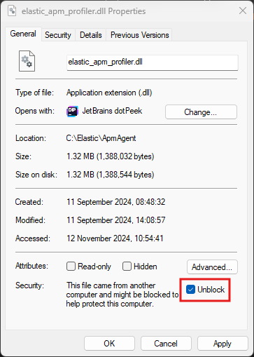

---
mapped_pages:
  - https://www.elastic.co/guide/en/apm/agent/dotnet/current/setup-auto-instrumentation.html
applies_to:
  stack:
  serverless:
    observability:
  product:
    apm_agent_dotnet: ga
---

# Profiler Auto instrumentation [setup-auto-instrumentation]


### Quick start [_quick_start]

The agent can automatically instrument .NET Framework and .NET applications using the [.NET CLR Profiling APIs](https://docs.microsoft.com/en-us/dotnet/framework/unmanaged-api/profiling/profiling-overview#the-profiling-api). The Profiling APIs provide a way to instrument an application or dependency code without code changes.

This approach works with the following

|     |     |
| --- | --- |
|  | **Operating system** |
| **Architecture** | **Windows** | **Linux** \*\* |
| x64 | .NET Framework 4.6.2+\*<br>.NET 8+ | .NET 8+ |

\* Due to binding issues introduced by Microsoft, we recommend at least .NET Framework 4.7.2 for best compatibility.*

\*\* Minimum GLIBC version 2.14.

::::{note}
While the profiler may work on older .NET runtimes such as .NET 6, it is only officially tested and supported on runtimes that are supported by Microsoft, currently .NET 8 and newer.
::::

::::{note}
The profiler-based agent only supports 64-bit applications. 32-bit applications aren’t supported.
::::

::::{note}
The profiler-based agent does not currently support ARM.
::::


It instruments the following assemblies:

| Integration name | NuGet package version(s) | Assembly version(s) |
| --- | --- | --- |
| AdoNet | part of .NET | System.Data 4.0.0 - 4.*.* |
| part of .NET | System.Data.Common 4.0.0 - 5.*.* |
| AspNet | part of .NET Framework | System.Web 4.0.0 - 4.*.* |
| Kafka | [Confluent.Kafka 1.4.0 - 2.*.*](https://www.nuget.org/packages/Confluent.Kafka) | Confluent.Kafka 1.4.0 - 2.*.* |
| MySqlCommand | [MySql.Data 6.7.0 - 8.*.*](https://www.nuget.org/packages/MySql.Data) | MySql.Data 6.7.0 - 8.*.* |
| NpgsqlCommand | [Npgsql 4.0.0 - 7.*.*](https://www.nuget.org/packages/Npgsql) | Npgsql 4.0.0 - 7.*.* |
| OracleCommand | [Oracle.ManagedDataAccess 12.2.1100 - 21.*.*](https://www.nuget.org/packages/Oracle.ManagedDataAccess) | Oracle.ManagedDataAccess 4.122.0 - 4.122.* |
| [Oracle.ManagedDataAccess.Core 2.0.0 - 3.*.*](https://www.nuget.org/packages/Oracle.ManagedDataAccess.Core) | Oracle.ManagedDataAccess 2.0.0 - 3.*.* |
| RabbitMQ | [RabbitMQ.Client 3.6.9 - 6.*.*](https://www.nuget.org/packages/RabbitMQ.Client) | RabbitMQ.Client 3.6.9 - 6.*.* |
| SqlCommand | part of .NET | System.Data 4.0.0 - 4.*.* |
| [System.Data.SqlClient 4.0.0 - 4.*.*](https://www.nuget.org/packages/System.Data.SqlClient) | System.Data.SqlClient 4.0.0 - 4.*.* |
| [Microsoft.Data.SqlClient 1.0.0 - 5.*.*](https://www.nuget.org/packages/Microsoft.Data.SqlClient) | Microsoft.Data.SqlClient 1.0.0 - 5.*.* |
| SqliteCommand | [Microsoft.Data.Sqlite 2.0.0 - 7.*.*](https://www.nuget.org/packages/Microsoft.Data.Sqlite) | Microsoft.Data.Sqlite 2.0.0 - 7.*.* |
| [System.Data.SQLite 1.0.0 - 2.*.*](https://www.nuget.org/packages/System.Data.SQLite) | System.Data.SQLite 1.0.0 - 2.*.* |

::::{important}
**The .NET CLR Profiling API allows only one profiler to be attached to a .NET process**. In light of this limitation, only one solution that uses the .NET CLR profiling API should be used by an application.

Auto instrumentation using the .NET CLR Profiling API can be used in conjunction with

* the [Public API](/reference/public-api.md) to perform manual instrumentation.
* NuGet packages that perform instrumentation using a `IDiagnosticsSubscriber` to subscribe to diagnostic events.

The version number of NuGet packages referenced by a project instrumented with a profiler must be the same as the version number of profiler zip file used.

::::


### General steps [_general_steps]

The general steps in configuring profiler auto instrumentation are as follows; See [Instrumenting containers and services](#instrumenting-containers-and-services) for configuration for common deployment environments.

1. Download the `elastic_apm_profiler_<version>.zip` file from the [Releases](https://github.com/elastic/apm-agent-dotnet/releases) page of the .NET APM Agent GitHub repository, where `<version>` is the version number to download. You can find the file under Assets.
2. Unzip the zip file into a folder on the host that is hosting the application to instrument.
3. Configure the following environment variables:

    ```sh
    set COR_ENABLE_PROFILING = "1"
    set COR_PROFILER = "{FA65FE15-F085-4681-9B20-95E04F6C03CC}"
    set COR_PROFILER_PATH = "<unzipped directory>\elastic_apm_profiler.dll" <1>
    set ELASTIC_APM_PROFILER_HOME = "<unzipped directory>"
    set ELASTIC_APM_PROFILER_INTEGRATIONS = "<unzipped directory>\integrations.yml"
    set ELASTIC_APM_SERVER_URL = "<apm server url>" <2>
    set ELASTIC_APM_SECRET_TOKEN = "<secret token>" <3>
    ```

    1. `<unzipped directory>` is the directory to which the zip file was unzipped in step 2.
    2. The URL of the APM server intake to which traces and metrics should be sent.
    3. The [secret token](docs-content://solutions/observability/apm/secret-token.md) used by the APM Agent to authenticate with APM server.


    ```sh
    set CORECLR_ENABLE_PROFILING = "1"
    set CORECLR_PROFILER = "{FA65FE15-F085-4681-9B20-95E04F6C03CC}"
    set CORECLR_PROFILER_PATH = "<unzipped directory>\elastic_apm_profiler.dll" <1>
    set ELASTIC_APM_PROFILER_HOME = "<unzipped directory>"
    set ELASTIC_APM_PROFILER_INTEGRATIONS = "<unzipped directory>\integrations.yml"
    set ELASTIC_APM_SERVER_URL = "<apm server url>" <2>
    set ELASTIC_APM_SECRET_TOKEN = "<secret token>" <3>
    ```

    1. `<unzipped directory>` is the directory to which the zip file was unzipped in step 2.
    2. The URL of the APM server intake to which traces and metrics should be sent.
    3. The [secret token](docs-content://solutions/observability/apm/secret-token.md) used by the APM Agent to authenticate with APM server.


    ```sh
    export CORECLR_ENABLE_PROFILING=1
    export CORECLR_PROFILER={FA65FE15-F085-4681-9B20-95E04F6C03CC}
    export CORECLR_PROFILER_PATH="<unzipped directory>/libelastic_apm_profiler.so" <1>
    export ELASTIC_APM_PROFILER_HOME="<unzipped directory>"
    export ELASTIC_APM_PROFILER_INTEGRATIONS="<unzipped directory>/integrations.yml"
    export ELASTIC_APM_SERVER_URL = "<apm server url>" <2>
    export ELASTIC_APM_SECRET_TOKEN = "<secret token>" <3>
    ```

    1. `<unzipped directory>` is the directory to which the zip file was unzipped in step 2.
    2. The URL of the APM server intake to which traces and metrics should be sent.
    3. The [secret token](docs-content://solutions/observability/apm/secret-token.md) used by the APM Agent to authenticate with APM server.


Ensure you start your application in a context where the set environment variables are visible.

With this setup, the .NET runtime loads Elastic’s CLR profiler into the .NET process, which loads and instantiates the APM agent early in application startup. The profiler monitors methods of interest and injects code to instrument their execution.


## Instrumenting containers and services [instrumenting-containers-and-services]

Using global environment variables causes profiler auto instrumentation to be loaded for **any** .NET process started on the host. Often, the environment variables should be set only for specific services or containers. The following sections demonstrate how to configure common containers and services.


### Docker containers [_docker_containers]

A build image containing the files for profiler auto instrumentation can be used as part of a [multi-stage build](https://docs.docker.com/develop/develop-images/multistage-build/)

```sh
ARG AGENT_VERSION=<VERSION> <1>

FROM alpine:latest AS build
ARG AGENT_VERSION
WORKDIR /source

# install unzip
RUN apk update && apk add zip curl

# pull down the zip file based on ${AGENT_VERSION} ARG and unzip
RUN curl -L -o elastic_apm_profiler_${AGENT_VERSION}.zip https://github.com/elastic/apm-agent-dotnet/releases/download/v${AGENT_VERSION}/elastic_apm_profiler_${AGENT_VERSION}.zip && \
    unzip elastic_apm_profiler_${AGENT_VERSION}.zip -d /elastic_apm_profiler_${AGENT_VERSION}
```

1. Replace `<VERSION>` with the newest release version number for the profiler zip file to be downloaded (e.g. ARG AGENT_VERSION=1.26.0).


The files can then be copied into a subsequent stage

```sh
COPY --from=build /elastic_apm_profiler_${AGENT_VERSION} /elastic_apm_profiler
```

Environment variables can be added to a Dockerfile to configure profiler auto instrumentation

```sh
ENV CORECLR_ENABLE_PROFILING=1
ENV CORECLR_PROFILER={FA65FE15-F085-4681-9B20-95E04F6C03CC}
ENV CORECLR_PROFILER_PATH=/elastic_apm_profiler/libelastic_apm_profiler.so
ENV ELASTIC_APM_PROFILER_HOME=/elastic_apm_profiler
ENV ELASTIC_APM_PROFILER_INTEGRATIONS=/elastic_apm_profiler/integrations.yml

ENTRYPOINT ["dotnet", "your-application.dll"]
```

::::{important}
You should also consider how to securely provide the the APM server URL and secret token as environment variables when you run your container. It is not recommended to include the secret token in the image as it may be accidently exposed.

::::


### Windows services [_windows_services]

Environment variables can be added to specific Windows services by adding an entry to the Windows registry. Using PowerShell

```powershell
$environment = [string[]]@(
  "COR_ENABLE_PROFILING=1",
  "COR_PROFILER={FA65FE15-F085-4681-9B20-95E04F6C03CC}",
  "COR_PROFILER_PATH=<unzipped directory>\elastic_apm_profiler.dll",
  "ELASTIC_APM_PROFILER_HOME=<unzipped directory>",
  "ELASTIC_APM_PROFILER_INTEGRATIONS=<unzipped directory>\integrations.yml"
  "ELASTIC_APM_SERVER_URL=<apm server url>"
  "ELASTIC_APM_SECRET_TOKEN=<secret token>")

Set-ItemProperty HKLM:SYSTEM\CurrentControlSet\Services\<service-name> -Name Environment -Value $environment
```

```powershell
$environment = [string[]]@(
  "CORECLR_ENABLE_PROFILING=1",
  "CORECLR_PROFILER={FA65FE15-F085-4681-9B20-95E04F6C03CC}",
  "CORECLR_PROFILER_PATH=<unzipped directory>\elastic_apm_profiler.dll", <1>
  "ELASTIC_APM_PROFILER_HOME=<unzipped directory>",
  "ELASTIC_APM_PROFILER_INTEGRATIONS=<unzipped directory>\integrations.yml"
  "ELASTIC_APM_SERVER_URL=<apm server url>" <2>
  "ELASTIC_APM_SECRET_TOKEN=<secret token>") <3>

Set-ItemProperty HKLM:SYSTEM\CurrentControlSet\Services\<service-name> -Name Environment -Value $environment <4>
```

1. `<unzipped directory>` is the directory to which the zip file was unzipped.
2. The URL of the APM server intake to which traces and metrics should be sent.
3. The [secret token](docs-content://solutions/observability/apm/secret-token.md) used by the APM Agent to authenticate with APM server.
4. `<service-name>` is the name of the Windows service.


The service must then be restarted for the change to take effect. With PowerShell

```powershell
Restart-Service <service-name>
```


### Internet Information Services (IIS) [_internet_information_services_iis]

For IIS versions *before* IIS 10, it is **not** possible to set environment variables scoped to a specific application pool, so environment variables need to set globally.

For IIS 10 *onwards*, environment variables can be set for an application pool using [AppCmd.exe](https://docs.microsoft.com/en-us/iis/get-started/getting-started-with-iis/getting-started-with-appcmdexe). With PowerShell

```powershell
$appcmd = "$($env:systemroot)\system32\inetsrv\AppCmd.exe"
$appPool = "<application-pool>" <1>
$profilerHomeDir = "<unzipped directory>" <2>
$environment = @{
  COR_ENABLE_PROFILING = "1"
  COR_PROFILER = "{FA65FE15-F085-4681-9B20-95E04F6C03CC}"
  COR_PROFILER_PATH = "$profilerHomeDir\elastic_apm_profiler.dll"
  ELASTIC_APM_PROFILER_HOME = "$profilerHomeDir"
  ELASTIC_APM_PROFILER_INTEGRATIONS = "$profilerHomeDir\integrations.yml"
  COMPlus_LoaderOptimization = "1" <3>
  ELASTIC_APM_SERVER_URL = "<apm server url>" <4>
  ELASTIC_APM_SECRET_TOKEN = "<secret token>" <5>
}

$environment.Keys | ForEach-Object {
  & $appcmd set config -section:system.applicationHost/applicationPools /+"[name='$appPool'].environmentVariables.[name='$_',value='$($environment[$_])']"
}
```

1. `<application-pool>` is the name of the Application Pool your application uses. For example, `IIS APPPOOL\DefaultAppPool`
2. `<unzipped directory>` is the full path to the directory in which the zip file was unzipped
3. Forces assemblies **not** to be loaded domain-neutral. There is currently a limitation where Profiler auto-instrumentation cannot instrument assemblies when they are loaded domain-neutral. This limitation is expected to be removed in future, but for now, can be worked around by setting this environment variable. See the [Microsoft documentation for further details](https://docs.microsoft.com/en-us/dotnet/framework/app-domains/application-domains#the-complus_loaderoptimization-environment-variable).
4. The URL of the APM server intake to which traces and metrics should be sent.
5. The [secret token](docs-content://solutions/observability/apm/secret-token.md) used by the APM Agent to authenticate with APM server.


```powershell
$appcmd = "$($env:systemroot)\system32\inetsrv\AppCmd.exe"
$appPool = "<application-pool>" <1>
$profilerHomeDir = "<unzipped directory>" <2>
$environment = @{
  CORECLR_ENABLE_PROFILING = "1"
  CORECLR_PROFILER = "{FA65FE15-F085-4681-9B20-95E04F6C03CC}"
  CORECLR_PROFILER_PATH = "$profilerHomeDir\elastic_apm_profiler.dll"
  ELASTIC_APM_PROFILER_HOME = "$profilerHomeDir"
  ELASTIC_APM_PROFILER_INTEGRATIONS = "$profilerHomeDir\integrations.yml"
  ELASTIC_APM_SERVER_URL = "<apm server url>" <3>
  ELASTIC_APM_SECRET_TOKEN = "<secret token>" <4>
}

$environment.Keys | ForEach-Object {
  & $appcmd set config -section:system.applicationHost/applicationPools /+"[name='$appPool'].environmentVariables.[name='$_',value='$($environment[$_])']"
}
```

1. `<application-pool>` is the name of the Application Pool your application uses. For example, `IIS APPPOOL\DefaultAppPool`.
2. `<unzipped directory>` is the full path to the directory in which the zip file was unzipped.
3. The URL of the APM server intake to which traces and metrics should be sent.
4. The [secret token](docs-content://solutions/observability/apm/secret-token.md) used by the APM Agent to authenticate with APM server.


::::{important}
Ensure that the location of the `<unzipped directory>` is accessible and executable to the [Identity account under which the Application Pool runs](https://docs.microsoft.com/en-us/iis/manage/configuring-security/application-pool-identities).

::::


Once environment variables have been set, stop and start IIS so that applications hosted in IIS will see the new environment variables.

```sh
net stop /y was
net start w3svc
```


### systemd / systemctl [_systemd_systemctl]

Environment variables can be added to specific services run with systemd by creating an environment.env file containing the following

```sh
CORECLR_ENABLE_PROFILING=1
CORECLR_PROFILER={FA65FE15-F085-4681-9B20-95E04F6C03CC}
CORECLR_PROFILER_PATH=/<unzipped directory>/libelastic_apm_profiler.so <1>
ELASTIC_APM_PROFILER_HOME=/<unzipped directory>
ELASTIC_APM_PROFILER_INTEGRATIONS=/<unzipped directory>/integrations.yml
ELASTIC_APM_SERVER_URL=<apm server url> <2>
ELASTIC_APM_SECRET_TOKEN=<secret token> <3>
```

1. `<unzipped directory>` is the directory to which the zip file was unzipped.
2. The URL of the APM server intake to which traces and metrics should be sent.
3. The [secret token](docs-content://solutions/observability/apm/secret-token.md) used by the APM Agent to authenticate with APM server.


Then adding an [`EnvironmentFile`](https://www.freedesktop.org/software/systemd/man/systemd.service.html#Command%20lines) entry to the service’s configuration file that references the path to the environment.env file

```sh
[Service]
EnvironmentFile=/path/to/environment.env
ExecStart=<command> <1>
```

1. the command that starts your service


After adding the `EnvironmentFile` entry, restart the service.

```sh
systemctl reload-or-restart <service>
```


## Profiler environment variables [profiler-configuration]

The profiler auto instrumentation has its own set of environment variables to manage the instrumentation. These are used in addition to [agent configuration](/reference/configuration.md) through environment variables.

`ELASTIC_APM_PROFILER_HOME`
:   The home directory of the profiler auto instrumentation. The home directory typically contains:

    * platform specific profiler assemblies
    * a directory for each compatible target framework, where each directory contains supporting managed assemblies for auto instrumentation.
    * an integrations.yml file that determines which methods to target for auto instrumentation


`ELASTIC_APM_PROFILER_INTEGRATIONS` *(optional)*
:   The path to the integrations.yml file that determines which methods to target for auto instrumentation. If not specified, the profiler will assume an integrations.yml exists in the home directory specified by `ELASTIC_APM_PROFILER_HOME` environment variable.

`ELASTIC_APM_PROFILER_EXCLUDE_INTEGRATIONS` *(optional)*
:   A semi-colon separated list of integrations to exclude from auto-instrumentation. Valid values are those defined in the `Integration name` column in the integrations table above.

`ELASTIC_APM_PROFILER_EXCLUDE_PROCESSES` *(optional)*
:   A semi-colon separated list of process names to exclude from auto-instrumentation. For example, `dotnet.exe;powershell.exe`. Can be used in scenarios where profiler environment variables have a global scope that would end up auto-instrumenting applications that should not be.

The following processes are **always** excluded from profiling by default.

* powershell.exe
* ServerManager.exe
* ReportingServicesService.exe
* RSHostingService.exe
* RSMananagement.exe
* RSPortal.exe
* RSConfigTool.exe

`ELASTIC_APM_PROFILER_EXCLUDE_SERVICE_NAMES` *(optional)*
:   A semi-colon separated list of APM service names to exclude from auto-instrumentation. Values defined are checked against the value of [`ELASTIC_APM_SERVICE_NAME`](/reference/config-core.md#config-service-name) environment variable.


The following service names are **always** excluded from profiling by default.

* SQLServerReportingServices

`OTEL_LOG_LEVEL` *(optional)*
:   The log level at which the profiler should log. Valid values are

* trace
* debug
* info
* warn
* error
* none

The default value is `warn`. More verbose log levels like `trace` and `debug` can affect the runtime performance of profiler auto instrumentation, so are recommended *only* for diagnostics purposes.

This takes precedence over the now deprecated `ELASTIC_APM_PROFILER_LOG` environment variable.

::::{note} 
Although prefixed with `OTEL_` we prefer `OTEL_LOG_LEVEL`, when present as this aligns with the configuration for OpenTelemetry SDKs, simplifying migrations.
::::

`OTEL_DOTNET_AUTO_LOG_DIRECTORY` *(optional)*
:   The directory in which to write profiler log files. If unset, defaults to

    * `%PROGRAMDATA%\elastic\apm-agent-dotnet\logs` on Windows
    * `/var/log/elastic/apm-agent-dotnet` on Linux


If the default directory cannot be written to for some reason, the profiler will try to write log files to a `logs` directory in the home directory specified by `ELASTIC_APM_PROFILER_HOME` environment variable.

This takes precedence over the now deprecated `ELASTIC_APM_PROFILER_LOG_DIR` environment variable.

::::{important}
The user account under which the profiler process runs must have permission to write to the destination log directory. Specifically, ensure that when running on IIS, the [AppPool identity](https://learn.microsoft.com/en-us/iis/manage/configuring-security/application-pool-identities) has write permissions in the target directory.
::::

::::{note} 
Although prefixed with `OTEL_` we prefer `OTEL_LOG_LEVEL`, when present as this aligns with the configuration for OpenTelemetry SDKs, simplifying migrations.
::::

`ELASTIC_OTEL_LOG_TARGETS` *(optional)*
:   A semi-colon separated list of targets for profiler logs. Valid values are

    * file
    * stdout


The default value is `file`, which logs to the directory specified by `ELASTIC_APM_PROFILER_LOG_DIR` environment variable.

This takes precedence over the now deprecated `ELASTIC_APM_PROFILER_LOG_TARGETS`


### Troubleshooting [_troubleshooting]


#### DLLs are blocked on Windows [windows-blocked-dlls]

Windows may automatically block downloaded DLL files if it considers them suspicious.

To unblock a DLL file on Windows, you can do the following:

* Right-click the DLL file in File Explorer
* Select Properties
* In the General tab, look for the Security section at the bottom
* Select the Unblock check box and click OK


