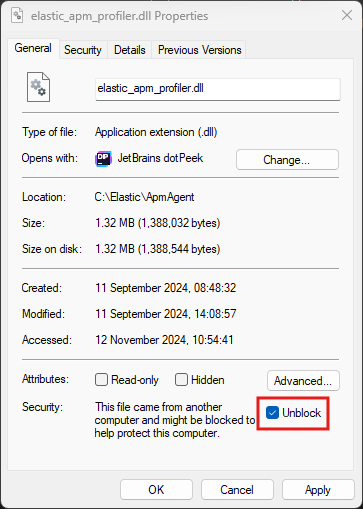

---
mapped_pages:
  - https://www.elastic.co/guide/en/apm/agent/dotnet/current/setup-auto-instrumentation.html
description: "Step-by-step guidance for enabling profiler-based, zero-code auto instrumentation in .NET applications by configuring environment variables and startup settings."
applies_to:
  stack:
  serverless:
    observability:
  product:
    apm_agent_dotnet: ga
---

# Profiler auto instrumentation (zero-code) [setup-auto-instrumentation]


## Overview [_overview]

Profiler auto instrumentation lets you add APM to a .NET application (including ASP.NET Core and ASP.NET apps) without modifying source code or adding NuGet packages. Set a few environment variables, start your application, and the profiler automatically captures incoming request transactions, outgoing HTTP calls, database queries, and more for the technologies listed below. This approach is useful for getting started quickly with zero code changes, for instrumenting applications you don't own, or for applying a single configuration change across all services on a host.

::::{note}
**Not sure whether you have .NET or .NET Framework?** ".NET" (formerly ".NET Core") refers to .NET 8, .NET 9, and .NET 10. ".NET Framework" is the older Windows-only runtime (versions 4.6.1 to 4.8.1). If you're unsure which your application targets, open its `.csproj` file and check the `<TargetFramework>` element: values like `net8.0` or `net10.0` mean .NET; values like `net472` or `net48` mean .NET Framework.
::::

::::{tip}
Not sure whether profiler auto instrumentation is the right setup for your application? Refer to [Choosing an approach](/reference/set-up-apm-net-agent.md#choosing-an-approach) for a comparison of zero-code and code-based options.
::::

This approach supports the following platforms and runtimes:

| Architecture | Windows | Linux\*\* |
|---|---|---|
| x64 | .NET Framework 4.6.2-4.8.1\*<br>.NET 8+ | .NET 8+ |

\* Due to binding issues introduced by Microsoft, we recommend at least .NET Framework 4.7.2 for best compatibility. Additionally, the [`VerifyServerCert`](/reference/config-reporter.md#config-verify-server-cert) and [`ServerCert`](/reference/config-reporter.md#config-server-cert) configuration options require .NET Framework 4.7.2 or higher to take effect; they have no effect on .NET Framework 4.6.2-4.7.1.

\*\* Minimum GLIBC version 2.14.

::::{note}
The profiler-based agent is only officially tested and supported on .NET 8 and newer we recommend .NET 10 for new projects. While it might work on older runtimes no longer supported by Microsoft, this is not guaranteed. ARM and 32-bit processes are not supported. IIS web garden (multi-worker process) mode is not supported.
::::

It instruments the following technologies:

**Web and networking**

| Technology | Required library |
| --- | --- |
| ASP.NET | built-in (.NET Framework) |
| ASP.NET Core | built-in (.NET), using startup hook† |
| HTTP client | built-in (.NET), using startup hook† |
| gRPC client | [Grpc.Net.Client ≥2.23.2 <3.0.0](https://www.nuget.org/packages/Grpc.Net.Client), using startup hook† |

::::{note}
gRPC server calls in ASP.NET Core applications are captured automatically using ASP.NET Core instrumentation. No separate integration is needed for the server side.
::::

**Data access**

| Technology | Required library |
| --- | --- |
| ADO.NET | built-in (.NET Framework) |
| Elasticsearch | [Elastic.Clients.Elasticsearch ≥8.0.0 <10.0.0](https://www.nuget.org/packages/Elastic.Clients.Elasticsearch), using startup hook† |
| Elasticsearch.Net (legacy) | [Elasticsearch.Net ≥7.6.0 <8.0.0](https://www.nuget.org/packages/Elasticsearch.Net), using startup hook† |
| NEST (legacy) | [NEST ≥7.6.0 <8.0.0](https://www.nuget.org/packages/NEST), using startup hook† |
| Entity Framework Core | [Microsoft.EntityFrameworkCore ≥8.0.0 ≤10.0.x](https://www.nuget.org/packages/Microsoft.EntityFrameworkCore), using startup hook† |
| MongoDB | [MongoDB.Driver ≥3.7.0 <4.0.0](https://www.nuget.org/packages/MongoDB.Driver), using startup hook†‡ |
| MySQL | [MySql.Data ≥6.7.0 <9.0.0](https://www.nuget.org/packages/MySql.Data) |
| Oracle | [Oracle.ManagedDataAccess ≥12.2.1100 <22.0.0](https://www.nuget.org/packages/Oracle.ManagedDataAccess)<br>[Oracle.ManagedDataAccess.Core ≥2.0.0 <4.0.0](https://www.nuget.org/packages/Oracle.ManagedDataAccess.Core) |
| PostgreSQL | [Npgsql ≥4.0.0 <8.0.0](https://www.nuget.org/packages/Npgsql) |
| SqlClient | built-in (.NET Framework)<br>[System.Data.SqlClient ≥4.0.0 <5.0.0](https://www.nuget.org/packages/System.Data.SqlClient)<br>[Microsoft.Data.SqlClient ≥1.0.0 <6.0.0](https://www.nuget.org/packages/Microsoft.Data.SqlClient) |
| SQLite (Microsoft.Data.Sqlite) | [Microsoft.Data.Sqlite ≥2.0.0 <9.0.0](https://www.nuget.org/packages/Microsoft.Data.Sqlite) |
| SQLite (System.Data.SQLite) | [System.Data.SQLite ≥1.0.0 <3.0.0](https://www.nuget.org/packages/System.Data.SQLite) |

**Messaging**

| Technology | Required library |
| --- | --- |
| Azure Service Bus | [Azure.Messaging.ServiceBus ≥7.0.0 <8.0.0](https://www.nuget.org/packages/Azure.Messaging.ServiceBus), using startup hook† |
| Kafka | [Confluent.Kafka ≥1.4.0 <3.0.0](https://www.nuget.org/packages/Confluent.Kafka) |
| RabbitMQ | [RabbitMQ.Client ≥3.6.9 <7.0.0](https://www.nuget.org/packages/RabbitMQ.Client) |

**Azure Storage**

| Technology | Required library |
| --- | --- |
| Azure Blob Storage | [Azure.Storage.Blobs ≥12.8.0 <13.0.0](https://www.nuget.org/packages/Azure.Storage.Blobs), using startup hook† |
| Azure Queue Storage | [Azure.Storage.Queues ≥12.6.0 <13.0.0](https://www.nuget.org/packages/Azure.Storage.Queues), using startup hook† |
| Azure File Share Storage | [Azure.Storage.Files.Shares ≥12.6.0 <13.0.0](https://www.nuget.org/packages/Azure.Storage.Files.Shares), using startup hook† |

† .NET only; not supported on .NET Framework. The profiler uses the [.NET startup hook](https://learn.microsoft.com/en-us/dotnet/core/tutorials/dotnet-startup-hooks) mechanism to automatically load both `DiagnosticSource` subscribers and the built-in OpenTelemetry Bridge.

‡ Captured using the built-in OpenTelemetry Bridge rather than a dedicated subscriber. `MongoDB.Driver` ≥3.7.0 emits native OpenTelemetry spans that the profiler captures through this bridge. If you have `MongoDB.Driver` 3.0-3.6, use the [MongoDB NuGet integration](/reference/setup-mongo-db.md) instead.

::::{important}
**The .NET CLR Profiling API allows only one profiler to be attached to a .NET process**. Because of this, only one solution that uses the .NET CLR profiling API should be used by an application.

Auto instrumentation using the .NET CLR Profiling API can be used in conjunction with

* OpenTelemetry native instrumentation using the [Activity](https://learn.microsoft.com/dotnet/api/system.diagnostics.activity) API and the [OpenTelemetry Bridge](/reference/opentelemetry-bridge.md).
* The [Public API](/reference/public-api.md) to perform manual instrumentation.
* NuGet packages that perform instrumentation using an `IDiagnosticsSubscriber` to subscribe to diagnostic events.

NuGet packages must use the same version number as the profiler zip file.
::::

## Prerequisites [_prerequisites]

Before starting, ensure you have:

* **APM server URL**: the URL of the APM server you want to send data to (for example, `https://my-apm-server:8200`). You can find this in your Elastic deployment settings.
* **API key**: used by the agent to authenticate with APM server. Refer to [API key](docs-content://solutions/observability/apm/api-keys.md) for details. If your environment uses secret tokens, set `ELASTIC_APM_SECRET_TOKEN` in place of `ELASTIC_APM_API_KEY` in the examples below.
* **Host access**: you must be able to set environment variables for the process or service you want to instrument (for example, using a Dockerfile, service definition, or system settings).
* **Supported platform**: verify that your runtime and architecture appear in the support table in the [Overview](#overview) section. If you are unsure which runtime your app targets, refer to the note about .NET vs .NET Framework in the same section.
* **Profiler zip version**: if you plan to add any `Elastic.Apm` NuGet packages alongside the profiler, download a zip whose version exactly matches the NuGet package versions you intend to use.


## General steps [_general_steps]

The general steps in configuring profiler auto instrumentation are as follows. Refer to [Instrumenting containers and services](#instrumenting-containers-and-services) for configuration for common deployment environments.

1. Download `elastic_apm_profiler_<version>.zip` from the [GitHub Releases page](https://github.com/elastic/apm-agent-dotnet/releases) (look under **Assets**, where `<version>` is the release version number).
2. Unzip the zip file into a folder on the host that is hosting the application to instrument.
3. Configure the following environment variables:

    **.NET Framework**

    PowerShell:

    ```powershell
    $env:COR_ENABLE_PROFILING = "1"
    $env:COR_PROFILER = "{FA65FE15-F085-4681-9B20-95E04F6C03CC}"
    $env:COR_PROFILER_PATH = "<unzipped directory>\elastic_apm_profiler.dll" <1>
    $env:ELASTIC_APM_PROFILER_HOME = "<unzipped directory>"
    $env:ELASTIC_APM_PROFILER_INTEGRATIONS = "<unzipped directory>\integrations.yml"
    $env:ELASTIC_APM_SERVER_URL = "<apm server url>" <2>
    $env:ELASTIC_APM_API_KEY = "<api key>" <3>
    $env:ELASTIC_APM_SERVICE_NAME = "<your-service-name>" <4>
    ```

    1. `<unzipped directory>` is the directory to which the zip file was unzipped in step 2.
    2. The URL of the APM server intake to which traces and metrics should be sent.
    3. The [API key](docs-content://solutions/observability/apm/api-keys.md) used by the APM Agent to authenticate with APM server.
    4. The name used to identify your service in APM. If not set, the agent uses the application assembly name.

    Command Prompt:

    ```cmd
    set COR_ENABLE_PROFILING=1
    set COR_PROFILER={FA65FE15-F085-4681-9B20-95E04F6C03CC}
    set COR_PROFILER_PATH=<unzipped directory>\elastic_apm_profiler.dll
    set ELASTIC_APM_PROFILER_HOME=<unzipped directory>
    set ELASTIC_APM_PROFILER_INTEGRATIONS=<unzipped directory>\integrations.yml
    set ELASTIC_APM_SERVER_URL=<apm server url>
    set ELASTIC_APM_API_KEY=<api key>
    set ELASTIC_APM_SERVICE_NAME=<your-service-name>
    ```

    **.NET on Windows**

    PowerShell:

    ```powershell
    $env:CORECLR_ENABLE_PROFILING = "1"
    $env:CORECLR_PROFILER = "{FA65FE15-F085-4681-9B20-95E04F6C03CC}"
    $env:CORECLR_PROFILER_PATH = "<unzipped directory>\elastic_apm_profiler.dll" <1>
    $env:ELASTIC_APM_PROFILER_HOME = "<unzipped directory>"
    $env:ELASTIC_APM_PROFILER_INTEGRATIONS = "<unzipped directory>\integrations.yml"
    $env:ELASTIC_APM_SERVER_URL = "<apm server url>" <2>
    $env:ELASTIC_APM_API_KEY = "<api key>" <3>
    $env:ELASTIC_APM_SERVICE_NAME = "<your-service-name>" <4>
    ```

    1. `<unzipped directory>` is the directory to which the zip file was unzipped in step 2.
    2. The URL of the APM server intake to which traces and metrics should be sent.
    3. The [API key](docs-content://solutions/observability/apm/api-keys.md) used by the APM Agent to authenticate with APM server.
    4. The name used to identify your service in APM. If not set, the agent uses the application assembly name.

    Command Prompt:

    ```cmd
    set CORECLR_ENABLE_PROFILING=1
    set CORECLR_PROFILER={FA65FE15-F085-4681-9B20-95E04F6C03CC}
    set CORECLR_PROFILER_PATH=<unzipped directory>\elastic_apm_profiler.dll
    set ELASTIC_APM_PROFILER_HOME=<unzipped directory>
    set ELASTIC_APM_PROFILER_INTEGRATIONS=<unzipped directory>\integrations.yml
    set ELASTIC_APM_SERVER_URL=<apm server url>
    set ELASTIC_APM_API_KEY=<api key>
    set ELASTIC_APM_SERVICE_NAME=<your-service-name>
    ```

    ::::{note}
    The only difference between the .NET Framework and .NET on Windows configurations above is the environment variable prefix: `COR_` for .NET Framework, `CORECLR_` for .NET.
    ::::

    **.NET on Linux**

    ```sh
    export CORECLR_ENABLE_PROFILING=1
    export CORECLR_PROFILER={FA65FE15-F085-4681-9B20-95E04F6C03CC}
    export CORECLR_PROFILER_PATH="<unzipped directory>/libelastic_apm_profiler.so" <1>
    export ELASTIC_APM_PROFILER_HOME="<unzipped directory>"
    export ELASTIC_APM_PROFILER_INTEGRATIONS="<unzipped directory>/integrations.yml"
    export ELASTIC_APM_SERVER_URL=<apm server url> <2>
    export ELASTIC_APM_API_KEY=<api key> <3>
    export ELASTIC_APM_SERVICE_NAME=<your-service-name> <4>
    ```

    1. `<unzipped directory>` is the directory to which the zip file was unzipped in step 2.
    2. The URL of the APM server intake to which traces and metrics should be sent.
    3. The [API key](docs-content://solutions/observability/apm/api-keys.md) used by the APM Agent to authenticate with APM server.
    4. The name used to identify your service in APM. If not set, the agent uses the application assembly name.

4. Start your application. The environment variables must be visible to the application process. Either set them in the same terminal session before starting, or configure them in your service or container definition.

5. Verify the agent is running.

   Send a test request to your application, then open **APM → Services** in Elastic Observability and look for your service name. Data typically appears within a few seconds of the first request.

   If no data appears after a minute, check the profiler log files for errors:

   * Windows: `%PROGRAMDATA%\elastic\apm-agent-dotnet\logs`
   * Linux: `/var/log/elastic/apm-agent-dotnet`

   Setting `OTEL_LOG_LEVEL=debug` produces more verbose output useful during troubleshooting. See [Troubleshoot APM .NET Agent](docs-content://troubleshoot/observability/apm-agent-dotnet/apm-net-agent.md) for further guidance.

::::{note}
At runtime, the .NET runtime loads Elastic's CLR profiler into the process early in startup. For .NET Framework, the profiler uses IL rewriting to instrument methods directly. For .NET, it additionally uses the startup hook mechanism to load `DiagnosticSource` subscribers and the built-in OpenTelemetry Bridge, which together cover the broader set of technologies marked †.
::::


## Instrumenting containers and services [instrumenting-containers-and-services]

Using global environment variables causes profiler auto instrumentation to be loaded for **any** .NET process started on the host. Often, the environment variables should be set only for specific services or containers. The following sections demonstrate how to configure common containers and services.


### Docker containers [_docker_containers]

The following example shows how to download the profiler and configure it as part of a [multi-stage build](https://docs.docker.com/develop/develop-images/multistage-build/). This example targets Linux containers, which use `libelastic_apm_profiler.so`. For Windows containers, use `elastic_apm_profiler.dll` and set `CORECLR_PROFILER_PATH` to point to the `.dll` file instead.

```dockerfile
ARG AGENT_VERSION=<VERSION> <1>

FROM alpine:latest AS profiler-download
ARG AGENT_VERSION
WORKDIR /source

RUN apk update && apk add unzip curl

RUN curl -L -o elastic_apm_profiler_${AGENT_VERSION}.zip \
    https://github.com/elastic/apm-agent-dotnet/releases/download/v${AGENT_VERSION}/elastic_apm_profiler_${AGENT_VERSION}.zip && \
    unzip elastic_apm_profiler_${AGENT_VERSION}.zip -d /elastic_apm_profiler

FROM <your-base-image> <2>

COPY --from=profiler-download /elastic_apm_profiler /elastic_apm_profiler

ENV CORECLR_ENABLE_PROFILING=1
ENV CORECLR_PROFILER={FA65FE15-F085-4681-9B20-95E04F6C03CC}
ENV CORECLR_PROFILER_PATH=/elastic_apm_profiler/libelastic_apm_profiler.so
ENV ELASTIC_APM_PROFILER_HOME=/elastic_apm_profiler
ENV ELASTIC_APM_PROFILER_INTEGRATIONS=/elastic_apm_profiler/integrations.yml
ENV ELASTIC_APM_SERVICE_NAME=<your-service-name> <3>

ENTRYPOINT ["dotnet", "your-application.dll"]
```

1. Replace `<VERSION>` with the version number of the profiler zip file to be downloaded (for example, `1.34.1`).
2. Replace `<your-base-image>` with your application's base image (for example, `mcr.microsoft.com/dotnet/aspnet:8.0`).
3. The name used to identify your service in APM.

::::{important}
Pass `ELASTIC_APM_SERVER_URL` and `ELASTIC_APM_API_KEY` at container runtime rather than baking them into the image. For example, pass them with `docker run -e ELASTIC_APM_SERVER_URL=... -e ELASTIC_APM_API_KEY=...` or using your orchestrator's secret injection.
::::


### Windows services [_windows_services]

Environment variables can be added to specific Windows services by adding an entry to the Windows registry. Using PowerShell:

::::{note}
The only difference between the .NET Framework and .NET service configurations below is the environment variable prefix: `COR_` for .NET Framework, `CORECLR_` for .NET.
::::

**.NET Framework service**

```powershell
$environment = [string[]]@(
  "COR_ENABLE_PROFILING=1",
  "COR_PROFILER={FA65FE15-F085-4681-9B20-95E04F6C03CC}",
  "COR_PROFILER_PATH=<unzipped directory>\elastic_apm_profiler.dll", <1>
  "ELASTIC_APM_PROFILER_HOME=<unzipped directory>",
  "ELASTIC_APM_PROFILER_INTEGRATIONS=<unzipped directory>\integrations.yml",
  "ELASTIC_APM_SERVER_URL=<apm server url>", <2>
  "ELASTIC_APM_API_KEY=<api key>", <3>
  "ELASTIC_APM_SERVICE_NAME=<your-service-name>") <4>

Set-ItemProperty HKLM:\SYSTEM\CurrentControlSet\Services\<service-name> -Name Environment -Value $environment <5>
```

1. `<unzipped directory>` is the directory to which the zip file was unzipped.
2. The URL of the APM server intake to which traces and metrics should be sent.
3. The [API key](docs-content://solutions/observability/apm/api-keys.md) used by the APM Agent to authenticate with APM server.
4. The name used to identify your service in APM.
5. `<service-name>` is the name of the Windows service.

**.NET service**

```powershell
$environment = [string[]]@(
  "CORECLR_ENABLE_PROFILING=1",
  "CORECLR_PROFILER={FA65FE15-F085-4681-9B20-95E04F6C03CC}",
  "CORECLR_PROFILER_PATH=<unzipped directory>\elastic_apm_profiler.dll", <1>
  "ELASTIC_APM_PROFILER_HOME=<unzipped directory>",
  "ELASTIC_APM_PROFILER_INTEGRATIONS=<unzipped directory>\integrations.yml",
  "ELASTIC_APM_SERVER_URL=<apm server url>", <2>
  "ELASTIC_APM_API_KEY=<api key>", <3>
  "ELASTIC_APM_SERVICE_NAME=<your-service-name>") <4>

Set-ItemProperty HKLM:\SYSTEM\CurrentControlSet\Services\<service-name> -Name Environment -Value $environment <5>
```

1. `<unzipped directory>` is the directory to which the zip file was unzipped.
2. The URL of the APM server intake to which traces and metrics should be sent.
3. The [API key](docs-content://solutions/observability/apm/api-keys.md) used by the APM Agent to authenticate with APM server.
4. The name used to identify your service in APM.
5. `<service-name>` is the name of the Windows service.


The service must then be restarted for the change to take effect. With PowerShell:

```powershell
Restart-Service <service-name>
```


### Internet Information Services (IIS) [_internet_information_services_iis]

Set environment variables on a specific Application Pool using `AppCmd.exe` (IIS 10+, available on Windows Server 2016 / Windows 10 and later). This scopes the profiler to that pool only and does not affect other .NET applications on the host. Run the following in an elevated PowerShell prompt:

**.NET Framework**

```powershell
$appcmd = "$($env:systemroot)\system32\inetsrv\AppCmd.exe"
$appPool = "<application-pool>" <1>
$profilerHomeDir = "<unzipped directory>" <2>
$environment = @{
  COR_ENABLE_PROFILING = "1"
  COR_PROFILER = "{FA65FE15-F085-4681-9B20-95E04F6C03CC}"
  COR_PROFILER_PATH = "$profilerHomeDir\elastic_apm_profiler.dll"
  ELASTIC_APM_PROFILER_HOME = "$profilerHomeDir"
  ELASTIC_APM_PROFILER_INTEGRATIONS = "$profilerHomeDir\integrations.yml"
  COMPlus_LoaderOptimization = "1" <3>
  ELASTIC_APM_SERVER_URL = "<apm server url>" <4>
  ELASTIC_APM_API_KEY = "<api key>" <5>
  ELASTIC_APM_SERVICE_NAME = "<your-service-name>" <6>
}

$environment.Keys | ForEach-Object {
  & $appcmd set config -section:system.applicationHost/applicationPools /+"[name='$appPool'].environmentVariables.[name='$_',value='$($environment[$_])']"
}
```

1. `<application-pool>` is the name of the Application Pool your application uses, as shown in IIS Manager. For example, `DefaultAppPool`.
2. `<unzipped directory>` is the full path to the directory in which the zip file was unzipped.
3. Forces assemblies **not** to be loaded domain-neutral. This is a .NET Framework IIS-specific workaround: the profiler cannot instrument assemblies loaded domain-neutral. This limitation is expected to be removed in future, but for now can be worked around by setting the `COMPlus_LoaderOptimization` environment variable. See the [Microsoft documentation for further details](https://docs.microsoft.com/en-us/dotnet/framework/app-domains/application-domains#the-complus_loaderoptimization-environment-variable). This setting is **not** needed for .NET (non-Framework) applications.
4. The URL of the APM server intake to which traces and metrics should be sent.
5. The [API key](docs-content://solutions/observability/apm/api-keys.md) used by the APM Agent to authenticate with APM server.
6. The name used to identify your service in APM.

**.NET**

```powershell
$appcmd = "$($env:systemroot)\system32\inetsrv\AppCmd.exe"
$appPool = "<application-pool>" <1>
$profilerHomeDir = "<unzipped directory>" <2>
$environment = @{
  CORECLR_ENABLE_PROFILING = "1"
  CORECLR_PROFILER = "{FA65FE15-F085-4681-9B20-95E04F6C03CC}"
  CORECLR_PROFILER_PATH = "$profilerHomeDir\elastic_apm_profiler.dll"
  ELASTIC_APM_PROFILER_HOME = "$profilerHomeDir"
  ELASTIC_APM_PROFILER_INTEGRATIONS = "$profilerHomeDir\integrations.yml"
  ELASTIC_APM_SERVER_URL = "<apm server url>" <3>
  ELASTIC_APM_API_KEY = "<api key>" <4>
  ELASTIC_APM_SERVICE_NAME = "<your-service-name>" <5>
}

$environment.Keys | ForEach-Object {
  & $appcmd set config -section:system.applicationHost/applicationPools /+"[name='$appPool'].environmentVariables.[name='$_',value='$($environment[$_])']"
}
```

1. `<application-pool>` is the name of the Application Pool your application uses, as shown in IIS Manager. For example, `DefaultAppPool`.
2. `<unzipped directory>` is the full path to the directory in which the zip file was unzipped.
3. The URL of the APM server intake to which traces and metrics should be sent.
4. The [API key](docs-content://solutions/observability/apm/api-keys.md) used by the APM Agent to authenticate with APM server.
5. The name used to identify your service in APM.

::::{important}
Ensure that the `<unzipped directory>` is accessible and executable by the [Identity account under which the Application Pool runs](https://docs.microsoft.com/en-us/iis/manage/configuring-security/application-pool-identities).
::::

Once the variables are set, stop and start IIS:

```powershell
Stop-Service WAS -Force   # Stops WAS (Windows Process Activation Service) and all dependent services
Start-Service W3SVC       # Starts the W3SVC (World Wide Web Publishing Service)
```

::::{note}
You can also set these variables through IIS Manager: select your Application Pool → **Advanced Settings** → **Environment Variables**. The variable names and values are identical to those in the scripts above.
::::

::::{warning}
Avoid setting these as machine-wide system environment variables. Doing so loads the profiler into **every** .NET process on the host. If AppCmd is unavailable and system-level variables are your only option, use `ELASTIC_APM_PROFILER_EXCLUDE_PROCESSES` or `ELASTIC_APM_PROFILER_EXCLUDE_SERVICE_NAMES` (refer to [Profiler environment variables](#profiler-configuration)) to limit scope.
::::


### Kubernetes [_kubernetes]

In Kubernetes, set environment variables in your Pod or Deployment spec using the `env` field on your container. First, add the profiler files to your container image (for example, using a multi-stage build as shown in the [Docker containers](#_docker_containers) section), then add the variables under `spec.containers[].env`:

```yaml
containers:
  - name: your-app
    image: your-image
    env:
      - name: CORECLR_ENABLE_PROFILING
        value: "1"
      - name: CORECLR_PROFILER
        value: "{FA65FE15-F085-4681-9B20-95E04F6C03CC}"
      - name: CORECLR_PROFILER_PATH
        value: "/elastic_apm_profiler/libelastic_apm_profiler.so"
      - name: ELASTIC_APM_PROFILER_HOME
        value: "/elastic_apm_profiler"
      - name: ELASTIC_APM_PROFILER_INTEGRATIONS
        value: "/elastic_apm_profiler/integrations.yml"
      - name: ELASTIC_APM_SERVICE_NAME
        value: "<your-service-name>"
      - name: ELASTIC_APM_SERVER_URL
        valueFrom:
          secretKeyRef:
            name: elastic-apm-secret
            key: server-url
      - name: ELASTIC_APM_API_KEY
        valueFrom:
          secretKeyRef:
            name: elastic-apm-secret
            key: api-key
```

Store `ELASTIC_APM_SERVER_URL` and `ELASTIC_APM_API_KEY` in a [Kubernetes Secret](https://kubernetes.io/docs/concepts/configuration/secret/) rather than hard-coding them in the spec. Create the secret with:

```shell
kubectl create secret generic elastic-apm-secret \
  --from-literal=server-url=https://your-apm-server:8200 \
  --from-literal=api-key=your-api-key
```


### systemd / systemctl [_systemd_systemctl]

On Linux, environment variables can be added to specific services managed by `systemd` by creating an environment file (for example, `elastic-apm.env`) containing the following:

```sh
CORECLR_ENABLE_PROFILING=1
CORECLR_PROFILER={FA65FE15-F085-4681-9B20-95E04F6C03CC}
CORECLR_PROFILER_PATH=/<unzipped directory>/libelastic_apm_profiler.so <1>
ELASTIC_APM_PROFILER_HOME=/<unzipped directory>
ELASTIC_APM_PROFILER_INTEGRATIONS=/<unzipped directory>/integrations.yml
ELASTIC_APM_SERVER_URL=<apm server url> <2>
ELASTIC_APM_API_KEY=<api key> <3>
ELASTIC_APM_SERVICE_NAME=<your-service-name> <4>
```

1. `<unzipped directory>` is the directory to which the zip file was unzipped.
2. The URL of the APM server intake to which traces and metrics should be sent.
3. The [API key](docs-content://solutions/observability/apm/api-keys.md) used by the APM Agent to authenticate with APM server.
4. The name used to identify your service in APM.


Then add an [`EnvironmentFile`](https://www.freedesktop.org/software/systemd/man/systemd.service.html#Command%20lines) entry to the service's configuration file that references the path to the environment file:

```sh
[Service]
EnvironmentFile=/path/to/elastic-apm.env
ExecStart=<command> <1>
```

1. The command that starts your service.


After adding the `EnvironmentFile` entry, restart the service.

```sh
systemctl reload-or-restart <service>
```


## Augmenting profiler coverage with NuGet packages [augmenting-with-nuget]

The profiler captures spans automatically for the supported libraries and frameworks listed in the preceding section. It cannot, however, instrument your own application code. For example: a background job, a business operation you want to trace, or a code path that doesn't go through a supported library will not be automatically traced. For that, use the [Public API](/reference/public-api.md) to create custom transactions and spans manually.

### Custom instrumentation with the Public API [augmenting-public-api]

The profiler initializes the agent at startup. You can call the [Public API](/reference/public-api.md) from your application code and your custom spans will appear nested within the transactions the profiler creates automatically. No additional agent setup is needed.

To access the Public API, add the `Elastic.Apm` NuGet package to your project:

```
dotnet add package Elastic.Apm --version <same-version-as-profiler>
```

Then use the API to create custom spans within an active transaction:

```csharp
using Elastic.Apm;

ElasticApm.Tracer.CurrentTransaction?.CaptureSpan("ProcessOrder", "business",
    span =>
    {
        // your application code here
    });
```

::::{note}
If there is no active transaction (for example, in a background job or startup code not triggered by an HTTP request), `CurrentTransaction` is `null` and the span is silently dropped. Use `ElasticApm.Tracer.CaptureTransaction(...)` to create a root transaction for those code paths.
::::

::::{important}
The `Elastic.Apm` package version must exactly match the version of the profiler zip file. A mismatch will cause assembly binding errors at startup.
::::

### Adding integration NuGet packages [augmenting-nuget-integrations]

Some technologies are not covered by the profiler and require a dedicated Elastic APM NuGet package: [Entity Framework 6](/reference/setup-ef6.md), [Redis (`StackExchange.Redis`)](/reference/setup-stackexchange-redis.md), [Azure CosmosDB](/reference/setup-azure-cosmosdb.md), [Azure Functions](/reference/setup-azure-functions.md), and [legacy Azure Service Bus (`Microsoft.Azure.ServiceBus`)](/reference/setup-azure-servicebus.md). For these technologies, install the corresponding package and follow its setup guide.

For technologies that the profiler already covers, dedicated NuGet packages also exist, for example [Entity Framework Core](/reference/setup-ef-core.md), [SqlClient](/reference/setup-sqlclient.md), [MongoDB](/reference/setup-mongo-db.md), [gRPC](/reference/setup-grpc.md), [Azure Service Bus](/reference/setup-azure-servicebus.md), and [Azure Storage](/reference/setup-azure-storage.md). You can add these packages alongside the profiler; both mechanisms use the same `DiagnosticSource`/`Activity`-based instrumentation and do not conflict with each other.

Refer to [Supported technologies](/reference/supported-technologies.md) for the full table showing which technologies are covered by the profiler, by NuGet packages, or by both.

::::{important}
When combining the profiler with any Elastic APM NuGet integration packages, every package version must exactly match the version of the profiler zip file. A version mismatch will cause errors at startup.
::::


## Profiler environment variables [profiler-configuration]

The profiler auto instrumentation has its own set of environment variables to manage the instrumentation. These are used in addition to [agent configuration](/reference/configuration.md) through environment variables.

`ELASTIC_APM_PROFILER_HOME`
:   The home directory of the profiler auto instrumentation. The home directory typically contains:

    * platform-specific profiler libraries
    * a directory for each compatible target framework, where each directory contains supporting libraries for auto instrumentation
    * an integrations.yml file that determines which methods to target for auto instrumentation


`ELASTIC_APM_PROFILER_INTEGRATIONS` *(optional)*
:   The path to the integrations.yml file that determines which methods to target for auto instrumentation. You don't normally need to set this. The profiler automatically looks for `integrations.yml` in the directory specified by `ELASTIC_APM_PROFILER_HOME`. Set it only if your integrations file is at a different location.

`ELASTIC_APM_PROFILER_EXCLUDE_INTEGRATIONS` *(optional)*
:   A semicolon-separated list of integrations to exclude from auto-instrumentation. Valid values are: `AdoNet`, `AspNet`, `Kafka`, `MySqlCommand`, `NpgsqlCommand`, `OracleCommand`, `RabbitMQ`, `SqlCommand`, `SqliteCommand`.

    This variable only controls integrations that use IL rewriting (the `integrations.yml`-based mechanism). Technologies instrumented using the startup hook (such as ASP.NET Core, Entity Framework Core, Elasticsearch, gRPC, Azure SDKs, and MongoDB) cannot be selectively turned off using this variable.

`ELASTIC_APM_PROFILER_EXCLUDE_PROCESSES` *(optional)*
:   A semi-colon separated list of process names to exclude from auto-instrumentation. For example, `dotnet.exe;powershell.exe`. Can be used in scenarios where profiler environment variables have a global scope that would end up auto-instrumenting applications that should not be.

The following processes are **always** excluded from profiling by default.

* powershell.exe
* ServerManager.exe
* ReportingServicesService.exe
* RSHostingService.exe
* RSManagement.exe
* RSPortal.exe
* RSConfigTool.exe

`ELASTIC_APM_PROFILER_EXCLUDE_SERVICE_NAMES` *(optional)*
:   A semi-colon separated list of APM service names to exclude from auto-instrumentation. Values defined are checked against the value of [`ELASTIC_APM_SERVICE_NAME`](/reference/config-core.md#config-service-name) environment variable.


The following service names are **always** excluded from profiling by default.

* SQLServerReportingServices

::::{note}
`OTEL_LOG_LEVEL`, `OTEL_DOTNET_AUTO_LOG_DIRECTORY`, and `ELASTIC_OTEL_LOG_TARGETS` use the `OTEL_` / `ELASTIC_OTEL_` prefix to align with EDOT .NET and OpenTelemetry SDK conventions, making migration between agents simpler.
::::

`OTEL_LOG_LEVEL` *(optional)*
:   The log level at which the profiler should log. Valid values are

    * trace
    * debug
    * info
    * warn
    * error
    * none

    The default value is `warn`. More verbose log levels like `trace` and `debug` can affect the runtime performance of profiler auto instrumentation, so are recommended only for diagnostics purposes.

    Supersedes the deprecated `ELASTIC_APM_PROFILER_LOG` environment variable.

`OTEL_DOTNET_AUTO_LOG_DIRECTORY` *(optional)*
:   The directory in which to write profiler log files. If unset, defaults to

    * `%PROGRAMDATA%\elastic\apm-agent-dotnet\logs` on Windows
    * `/var/log/elastic/apm-agent-dotnet` on Linux

    If the default directory cannot be written to, the profiler falls back to a `logs` subdirectory inside `ELASTIC_APM_PROFILER_HOME`.

    Supersedes the deprecated `ELASTIC_APM_PROFILER_LOG_DIR` environment variable.

::::{important}
The user account under which the profiler process runs must have permission to write to the destination log directory. Specifically, ensure that when running on IIS, the [AppPool identity](https://learn.microsoft.com/en-us/iis/manage/configuring-security/application-pool-identities) has write permissions in the target directory.
::::

`ELASTIC_OTEL_LOG_TARGETS` *(optional)*
:   A semi-colon separated list of targets for profiler logs. Valid values are

    * file
    * stdout

    The default value is `file`, which logs to the directory specified by `OTEL_DOTNET_AUTO_LOG_DIRECTORY`.

    Supersedes the deprecated `ELASTIC_APM_PROFILER_LOG_TARGETS`.


## Troubleshooting [_troubleshooting]


### DLLs are blocked on Windows [windows-blocked-dlls]

Windows may automatically block downloaded DLL files if it considers them suspicious.

To unblock a DLL file on Windows, you can do the following:

* Right-click the DLL file in File Explorer
* Select Properties
* In the General tab, look for the Security section at the bottom
* Select the Unblock check box and click OK



For further troubleshooting guidance, refer to [Troubleshoot APM .NET Agent](docs-content://troubleshoot/observability/apm-agent-dotnet/apm-net-agent.md).
