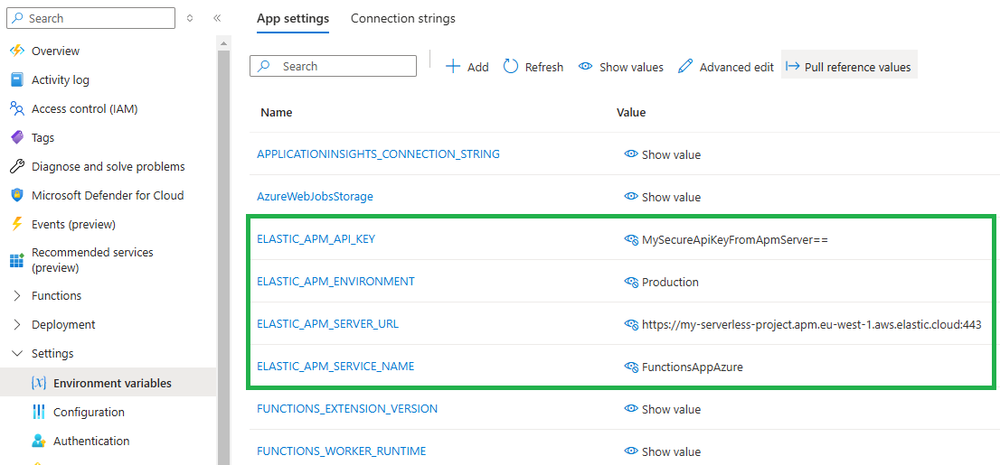

---
mapped_pages:
  - https://www.elastic.co/guide/en/apm/agent/dotnet/current/setup-azure-functions.html
applies_to:
  stack:
  serverless:
    observability:
  product:
    apm_agent_dotnet: ga
---

# Azure Functions [setup-azure-functions]

The .NET APM Agent can trace function invocations in an [Azure Functions](https://learn.microsoft.com/en-us/azure/azure-functions) app. Two execution models are supported.

**Don't know which model you're using?** Isolated worker is the recommended and current model. In-process is legacy (reaching end-of-support November 10, 2026). If you're creating a new Azure Function app, use **isolated worker**. If you have an existing in-process app and want to add APM, you'll find instructions in the in-process section below.


## Prerequisites [_prerequisites]

You need an APM Server to send APM data to. Follow the [APM Quick start](docs-content://solutions/observability/apm/get-started.md) if you have not set one up yet. You will need your **APM server URL** and an APM server **API key** for configuring the APM agent below. (If your APM Server uses secret tokens instead, both are supported.)

You will also need an Azure Function app to monitor running on **.NET 8+** (for isolated worker model) or **.NET Framework 4.7.2+ or .NET 8+** (for in-process model; .NET 8 requires the `FUNCTIONS_INPROC_NET8_ENABLED=1` setting). If you do not have an existing one, you can follow [this Azure guide](https://learn.microsoft.com/en-us/azure/azure-functions/create-first-function-cli-csharp) to create one.


## Azure Functions isolated worker model [_azure_functions_isolated_worker_model]

You can also take a look at and use this [Azure Functions isolated worker example](https://github.com/elastic/apm-agent-dotnet/tree/main/test/azure/applications/Elastic.AzureFunctionApp.Isolated) app with Elastic APM already integrated.


### Step 1: Add the NuGet package [azure-functions-setup]

Add the `Elastic.Apm.Azure.Functions` NuGet package to your Azure Functions project:

```bash
dotnet add package Elastic.Apm.Azure.Functions
```


### Step 2: Add the tracing middleware [_step_2_add_the_tracing_middleware]

Register `ApmMiddleware` in your `Program.cs`. The following element uses `ConfigureFunctionsWebApplication`, which is the recommended approach when using the [ASP.NET Core integration](https://learn.microsoft.com/en-us/azure/azure-functions/dotnet-isolated-process-guide#aspnet-core-integration) (requires the `Microsoft.Azure.Functions.Worker.Extensions.Http.AspNetCore` package):

```csharp
using Elastic.Apm.Azure.Functions;
using Microsoft.Extensions.Hosting;

var host = new HostBuilder()
  .ConfigureFunctionsWebApplication(builder =>
  {
    builder.UseMiddleware<ApmMiddleware>();
  })
  .Build();

host.Run();
```

If your app uses `ConfigureFunctionsWorkerDefaults` instead, replace the method name. The middleware registration syntax is the same.


### Step 3: Configure the APM agent [_step_3_configure_the_apm_agent]

The APM agent can be configured with environment variables.

```yaml
ELASTIC_APM_SERVER_URL: <your APM server URL from the prerequisites step>
ELASTIC_APM_API_KEY: <your APM API key from the prerequisites step>
ELASTIC_APM_ENVIRONMENT: <your environment>
ELASTIC_APM_SERVICE_NAME: <your service name> (optional)
```

If `ELASTIC_APM_SERVICE_NAME` is not configured, the agent will use a fallback value.

* **Local development** - The discovered service name (the entry Assembly name) will be used.
* **Azure** - The Function App name (retrieved from the `WEBSITE_SITE_NAME` environment variable) will be used.

**Configuring in Local development**

While developing your Function locally, you can configure the agent by providing the environment variables via the `local.settings.json` file.

For example:

```json
{
  "IsEncrypted": false,
  "Values": {
    "AzureWebJobsStorage": "UseDevelopmentStorage=true",
    "FUNCTIONS_WORKER_RUNTIME": "dotnet-isolated",
    "ELASTIC_APM_ENVIRONMENT": "Development",
    "ELASTIC_APM_SERVICE_NAME": "MyServiceName",
    "ELASTIC_APM_SERVER_URL": "https://your-apm-server:443",
    "ELASTIC_APM_API_KEY": "MySecureApiKeyFromApmServer=="
  }
}
```

**Configuring in Azure**

Using environment variables allows you to use [application settings in the Azure Portal](https://learn.microsoft.com/en-us/azure/azure-functions/functions-how-to-use-azure-function-app-settings?tabs=portal#settings), enabling you to update settings without needing to re-deploy code.

Open *Settings > Environment variables* for your Function App in the Azure Portal and configure the ELASTIC_APM_* variables as required.

For example:




Once configured, see [Verify and troubleshoot](#_verify_and_troubleshoot) to confirm data is flowing.


## Azure Functions in-process model [_azure_functions_in_process_model]

::::{important}
The Azure Functions in-process model reaches end of support on November 10, 2026. We recommend migrating to the [isolated worker model](https://learn.microsoft.com/en-us/azure/azure-functions/migrate-dotnet-to-isolated-model) and following the [isolated worker model setup instructions](#_azure_functions_isolated_worker_model) on this page instead.
::::

You can also take a look at and use this [Azure Functions in-process example](https://github.com/elastic/apm-agent-dotnet/tree/main/test/azure/applications/Elastic.AzureFunctionApp.InProcess) app with Elastic APM already integrated.


### Step 1: Add the NuGet package [azure-functions-in-process-setup]

Add the `Elastic.Apm.Azure.Functions` NuGet package to your Azure Functions project:

```bash
dotnet add package Elastic.Apm.Azure.Functions
```


### Step 2: Register the APM agent [_step_2_register_the_apm_agent_in_process]

The in-process model does not support middleware. Instead, create a startup class that inherits `FunctionsStartup` and call `AddElasticApm()` on the `IFunctionsHostBuilder`:

```csharp
using Elastic.Apm.Azure.Functions;
using Microsoft.Azure.Functions.Extensions.DependencyInjection;

[assembly: FunctionsStartup(typeof(MyNamespace.Startup))]

namespace MyNamespace;

public class Startup : FunctionsStartup
{
    public override void Configure(IFunctionsHostBuilder builder) =>
        builder.AddElasticApm();
}
```

The `[assembly: FunctionsStartup]` attribute tells the Azure Functions runtime to invoke this class at startup. No changes to individual function classes are needed.


### Step 3: Configure the APM agent [_step_3_configure_the_apm_agent_in_process]

The APM agent is configured with environment variables:

```yaml
ELASTIC_APM_SERVER_URL: <your APM server URL from the prerequisites step>
ELASTIC_APM_API_KEY: <your APM API key from the prerequisites step>
ELASTIC_APM_ENVIRONMENT: <your environment>
ELASTIC_APM_SERVICE_NAME: <your service name> (optional)
```

If `ELASTIC_APM_SERVICE_NAME` is not configured, the agent uses the same fallback values as the isolated worker model:

* **Local development** - The discovered service name (the entry Assembly name) will be used.
* **Azure** - The Function App name (retrieved from the `WEBSITE_SITE_NAME` environment variable) will be used.

**Configuring for local development**

Add the `ELASTIC_APM_*` variables to your `local.settings.json` file. Note that `FUNCTIONS_WORKER_RUNTIME` must be set to `dotnet` (not `dotnet-isolated`). When targeting .NET 8, the `FUNCTIONS_INPROC_NET8_ENABLED` setting is also required to opt in to in-process support on that runtime:

```json
{
  "IsEncrypted": false,
  "Values": {
    "AzureWebJobsStorage": "UseDevelopmentStorage=true",
    "FUNCTIONS_WORKER_RUNTIME": "dotnet",
    "FUNCTIONS_INPROC_NET8_ENABLED": "1",
    "ELASTIC_APM_ENVIRONMENT": "Development",
    "ELASTIC_APM_SERVICE_NAME": "MyServiceName",
    "ELASTIC_APM_SERVER_URL": "https://your-apm-server:443",
    "ELASTIC_APM_API_KEY": "MySecureApiKeyFromApmServer=="
  }
}
```

**Configuring in Azure**

Open *Settings → Environment variables* for your Function App in the Azure Portal and configure the `ELASTIC_APM_*` variables as required. If targeting .NET 8, also add `FUNCTIONS_INPROC_NET8_ENABLED` with a value of `1`.

Using environment variables allows you to use [application settings in the Azure Portal](https://learn.microsoft.com/en-us/azure/azure-functions/functions-how-to-use-azure-function-app-settings?tabs=portal#settings), enabling you to update settings without needing to re-deploy code.

Once configured, see [Verify and troubleshoot](#_verify_and_troubleshoot) to confirm data is flowing.


## Verify and troubleshoot [_verify_and_troubleshoot]

**Verify in Kibana**

After deploying your function or running it locally:

1. Open Kibana and navigate to **Observability** → **Applications** → **Service inventory**
2. Look for your service name (configured via `ELASTIC_APM_SERVICE_NAME` or the function app name)
3. Click on the service to see captured transactions and spans

On Consumption plans, allow 30-60 seconds for the first transaction to appear after invoking your function.

**Service doesn't appear in Kibana**

- Verify `ELASTIC_APM_SERVER_URL` is reachable and correct
- Confirm `ELASTIC_APM_API_KEY` has the required permissions on your APM Server
- Check your function's application logs in the Azure Portal for APM-related errors
- Invoke the function at least once to generate a transaction

**No transactions appear locally**

- Ensure the APM Server URL in `local.settings.json` is accessible (not `localhost` if running in Docker)
- Verify your function was actually invoked (check the HTTP response)
- Confirm middleware is registered correctly in `Program.cs` (isolated model) or `Startup.cs` (in-process model)


## Limitations [azure-functions-limitations]

Azure Functions instrumentation currently does *not* collect system metrics (CPU, memory, garbage collection) in the background because of a concern with unintentionally increasing Azure Functions costs (for Consumption plans). However, **all transactions, spans, and application-level data are still collected**.

The **in-process model** only traces HTTP-triggered function invocations. Non-HTTP triggers (such as Timer, Queue, and Service Bus triggers) are not captured. If you need tracing for non-HTTP triggers, migrate to the [isolated worker model](https://learn.microsoft.com/en-us/azure/azure-functions/migrate-dotnet-to-isolated-model) and follow the [isolated worker setup instructions](#_azure_functions_isolated_worker_model) on this page. The **isolated worker model** traces all trigger types.

